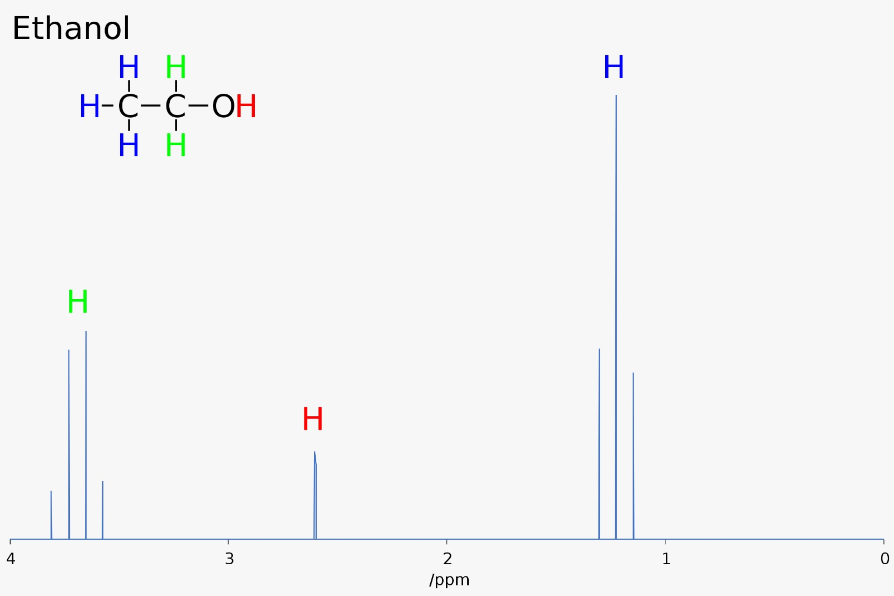

# MolecularGNN

### Predicting scalar coupling constants

In molecular structures, the **scalar coupling constants (SCC)** represent the magnetic interaction between two atoms.

When you have a solution of unknown molecules, the most common tool used to elucidate the structure of the molecules is the **NMR** (Nuclear Magnetic Resonance). NMR gives informations about the SCC. These couplings contain information about the distance / angles between pairs of atoms so an NMR spectra can be used to find the structure of the simple unknown molecule. However, when the molecule is more complex (has a lot of atoms), these information will not be enough to predict the structure with 100% certainty.

<div style="text-align:center">
    
    <p style="text-align: center;">Nuclear Magnetic Resonance of Ethanol. Here, only the nJHH coupling are present.</p>
</div>

<br/><br/> 

If you have an unknown molecule that you suspect to be a target molecule, having the exact values of its SCC allows you to validate whether or not the unknown molecule is the target molecule, by comparing these values with those on the NMR spectra. That is why it is crucial to be able to know the SCC values of a molecule.

By employing advanced techniques derived from quantum mechanics, you can precisely compute scalar coupling constants based solely on a 3D molecular structure. Nevertheless, these calculations, rooted in quantum mechanics, are **very expensive**, taking days or even weeks for each molecule. As a result, their practical utility is constrained in everyday workflow scenarios.

This motivates our search of some more rapid and efficient computations of SCC.

Thus, we are motivated to explore faster and more efficient methods for computing SCC. These constants are denoted as **nJXY**, where 'n' indicates the number of bonds between atoms X and Y (e.g., **1JHC** represents the SCC between directly bonded hydrogen and carbon atoms). Our goal is to develop methods that rapidly compute these values, providing a practical alternative to traditional quantum mechanical calculations.

Alongside this notebook, we will use the $\texttt{logMAE}$ loss function as a performance metric to compare our models.

Thus, we will want to minimize the score, defined as $$\text{score} = \log \left( \frac{1}{n} \sum_{i=1}^{n} |y_i - \hat{y}_i| \right)$$

where $n$ is the number of SCC that we want to predict, $y_i$ is the true value of the SCC, and $\hat{y}_i$ is the predicted value of the SCC.

### Dataset 

We use a dataset taken from a Kaggle competition (Predicting Molecular Properties - Can you measure the magnetic interactions between a pair of atoms?). Our analysis will be based on two files from this dataset: $\texttt{train.csv}$ and $\texttt{structures.csv}$, which together represent 85012 unique molecules.

We perform some feature engineering in the files $\texttt{make\_dataset.ipynb}$, $\texttt{BondFeatures.ipynb}$, and $\texttt{make\_angle\_dataframe.ipynb}$.

### Baseline 

An XGBoost baseline can be found in the file  $\texttt{xgb\_baseline.ipynb}$.

### Training 

In order to train the MPNN, run 

```bash
python MPNN_train.py
```

It will launch the training with the parameters specified at the beginning of the file.

You can then the following command to see the score (log MAE) of the MPNN.

```bash
python MPNN_score.py
```

